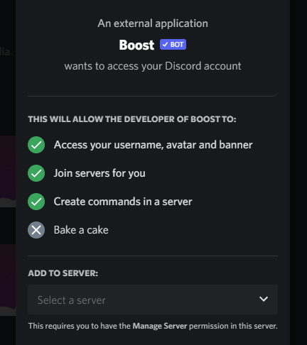
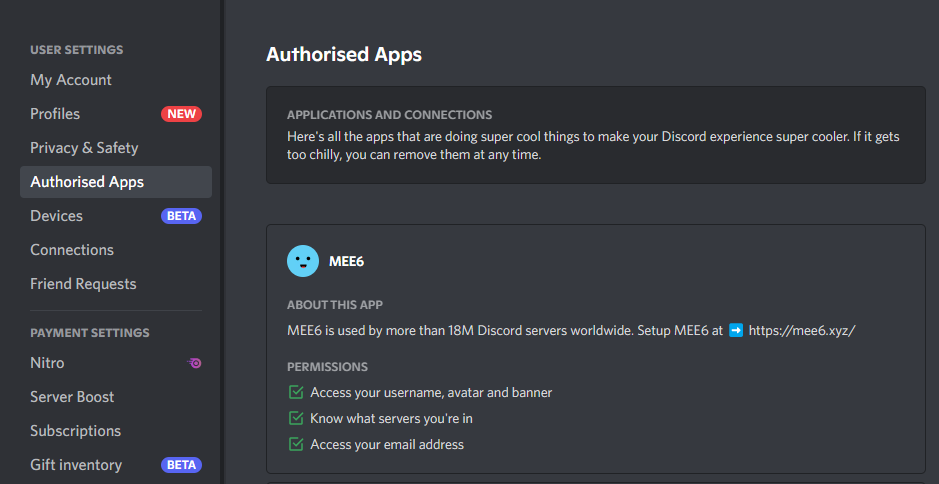
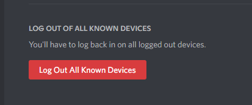

# Basic Discord Safety Guide

There are several layers to this, depending on how important you think your account is.

## The average Nitro scam

This part is essential. Discord has a pretty powerful way of telling genuine Nitro gifts from fakes.

This right here is a REAL Nitro gift. Note that it:
- specifies the username of the gift creator
- the duration
- has an ACCEPT button INSIDE the embed
- has an expiry

A scam bot can't fake this embed. Click the "Accept" button **within** the embed. If it works, it's a real gift. 

No embed form accessible to anyone outside of Discord exists with a button inside, only below. 

In case you open the discord.gift link in your browser, it's even more apparent. You just have to make sure the link is REALLY discord.gift. 

It's a good idea to copy the link you got, delete everything except the part behind the last / and re-typing "https://discord.gift/" in front of it. This way, you can be entirely sure you have ended up on the actual Discord website.

**IT IS NOT SUFFICIENT TO SIMPLY LOOK AT IT.** Your eyes aren't magical; no level of "tech skill" will save you from this.

- discord.gift

- dlscord.gift

- discord.gIft

These are easy, right? The first one is real.

Now, what about these?

- disсord.gift

- discоrd.gift

No, that is not the same link. Neither of them are real. This one is: discord.gift

The first has a Cyrillic "c" which looks the **EXACT same** to the human eye, yet leads to a completely different destination. 

The second one has a Cyrillic "o" instead of the Latin "c." The same thing applies. 

This is referred to as a homograph attack and is why you should not log in on ANY links you clicked. Seriously, take the five seconds, **type the domain you expect to be on yourself.**

### Fake Gift Example

This is a fake Discord Nitro gift, and one of the more sophisticated ones.

The name (albeit "Discord" is bullshit) is there, and duration and expiry are present. However, note the "Accept" button. It's not inside the embed.

If you can't click an "ACCEPT" button inside the embed, it's fake. In this case, the fake embed is just an image. The "Accept" button below is a direct link to a third-party application.

This application is trying to get you to grant dangerous permissions to it (see the section below this.)

## OAuth integrations 

Nowadays, a public standard allows websites to develop integrations with partial data access to users of a service called "OAuth."

Users log in on the Discord site itself, the third-party site then receives a temporary token allowing access to only the data you agreed to share. 

There are MANY of these permissions, called "scopes" by the OAuth standard.
Some are more dangerous than others and should not really be given.

- IDENTIFY: The most common scope (and the minimum one). This can do nothing except retrieve your user id, username, and some metadata. 

- EMAIL: Same as IDENTIFY, but also allows read-only access to your email.

- CONNECTIONS: Allows reading the sites/services you have connected to in Settings -> Connections

- GUILDS: Allows reading a list of the guilds you're in.

Everything except IDENTIFY may be a privacy issue. Think before giving permission. Does the service need this information? If not, **do not grant it.**

A scope that you should rarely ever grant is GUILDS.JOIN, or called "Join servers for you," by the login page. 

There is no reason for the vast majority of sites ever to use this, and you will likely end up with the site being malicious and joining you to servers paying for "boosting." It should be obvious: these servers are not good. Most of the time, they host illegal content or scams.

Scroll back up to the section above. See that permission right there?

You can review your current site connections in Settings -> Authorized Apps.

Come on, do a little spring cleaning. Go to that page and remove everything you don't actively need. 

Re-authorizing is easy and takes 10 seconds at most. There will be no data loss or anything.

One important note: **Connections can never send messages, add bots or do ANYTHING except join servers on your behalf.** If this happens, your account itself is compromised.

## QR Codes

Don't scan QR codes with the mobile app. That's it.

There is NEVER a reason to do it, except when you're on the main Discord login page and try to log in.

Anything else is a scam and will result in your account being stolen.

## Disaster Recovery

So your account was compromised through malware or a fake login page that you fell for.

### If you still have access:

Visit Settings -> Devices and scroll down to the red button.

Click it, confirm, and all Discord login sessions except your own are revoked immediately. This will require you to enter your password but will end the compromise of your account immediately. 

Check your servers and DMs, and make sure the attacker didn't do anything malicious.

### If you don't have access:

Contact the mods of servers you're on. Somehow inform them you're compromised.

Then send an email to Discord support detailing your username, email, a rough time of compromise, and other supporting information. 

**They are slow**, but this is sadly the only way. If you have no device with a valid Discord session and the attacker changed the email/password, recovery without the help of Discord itself is impossible.

# A note on 2FA

2FA can only protect against password leakage. It will not help you in any way when you run malware on the PC that you have Discord installed in or log into a phishing page that also supports capturing 2FA information you enter (which most do nowadays).

It's not a silver bullet; it's merely an obstacle that makes logging in with a stolen password impossible (which is still CRITICAL to have!!!). Once an attacker has a valid session identifier (either through malware or valid credentials being entered on a phishing page), 2FA is not a factor anymore.
